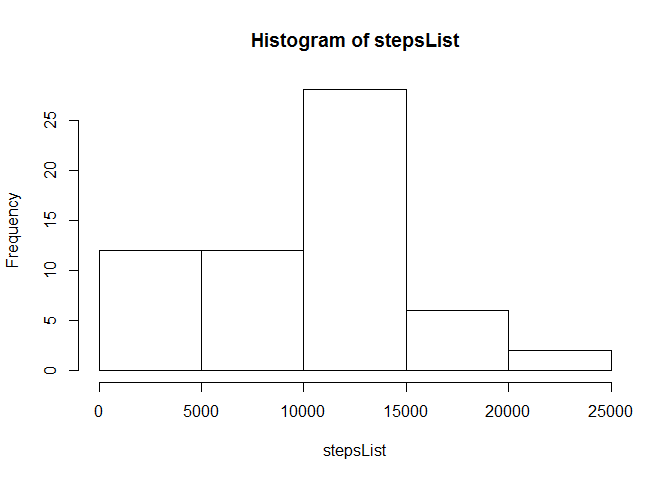
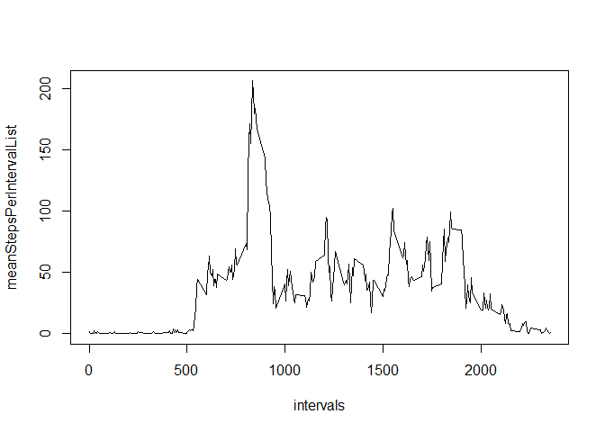
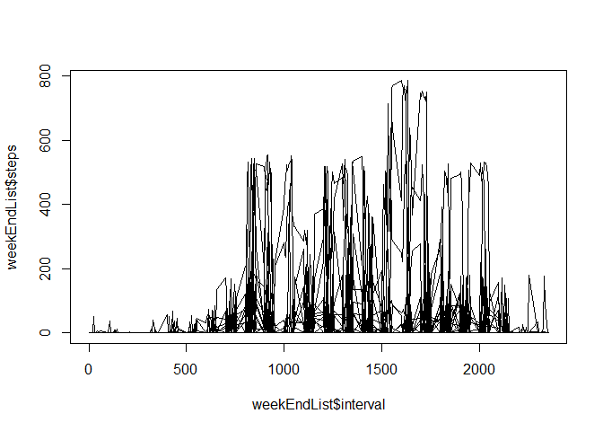

# Reproducible Research: Peer Assessment 1


## Loading and preprocessing the data
##     * read the data
##     * create a list of days from the data set

```r
    rawData <- read.csv("activity.csv")

    days <- as.character(unique(rawData$date))
```


## What is mean total number of steps taken per day?
###Initialize the list of steps with the first day.

```r
    firstDay <- days[1]
    stepsList <- sum(subset(rawData$steps, rawData$date == firstDay, na.rm = T)) 
```
    
###Add the remaining steps per day to the list.

```r
    for( i in 2:length(days)) {
        day <- days[i]
        stepsList <- c(stepsList, sum(subset(rawData$steps, rawData$date == day), na.rm = T) )
    
    }
```
###A histogram of steps per day 

```r
    hist(stepsList)
```

 
###The mean of steps per day in the period

```r
    print(mean(stepsList, na.rm = T) ) 
```

```
## [1] 9510.133
```
###The median of steps per day in the period

```r
    print(median(stepsList, na.rm = T) )
```

```
## [1] 10417
```


## What is the average daily activity pattern?
###Initialize the list of mean steps in the first interval.

```r
    intervals <- unique(as.character(rawData$interval))
    firstInterval <- intervals[1]
    meanStepsPerIntervalList <- mean(subset(rawData$steps, rawData$interval == firstInterval), na.rm = T) 
```
###Add the remaining means of steps per interval to the list.

```r
    for( i in 2:length(intervals)) {
        interval <- intervals[i]
        meanStepsPerIntervalList <- c(meanStepsPerIntervalList, mean(subset(rawData$steps, rawData$interval == interval) , na.rm = T ) )
        
    }
```
###plot

```r
    plot(intervals, meanStepsPerIntervalList, type="l")
```

 

###Max number of steps per interval on average

```r
    IntervalMeanTable <- (cbind (intervals, meanStepsPerIntervalList))
    maxMean <- max(as.numeric(IntervalMeanTable[,2]))
    maxInterval <- subset(IntervalMeanTable, as.numeric(IntervalMeanTable[,2])==maxMean)
    print(maxInterval[1])    
```

```
## [1] "835"
```
## Imputing missing values
### Total number of NA rows

```r
    print( sum( is.na( rawData ) ) )
```

```
## [1] 2304
```
### Impute missing values with the mean of steps during the given interval

```r
    firstImpute <- as.numeric( IntervalMeanTable[1,2] )
    impData <- rawData[1,]
    impData[1,1] <- firstImpute
    
    for ( i in 2:dim( rawData )[1]  ) {
        impData[i,] <- rawData[i,]
        if(is.na( rawData[i,1]  ) )  {
            interval <- rawData[i,3]
            nextImputeInterval <- subset(IntervalMeanTable, as.numeric( IntervalMeanTable[,1])==interval)
            impData[i,1] <- nextImputeInterval[2]
        }
    }
```
### Histogram of data with imputed values included
###Initialize the list of steps with the first day.

```r
    firstDay <- days[1]
    stepsList <- sum(subset(as.numeric(impData$steps), impData$date == firstDay, na.rm = T)) 
```
    
###Add the remaining steps per day to the list.

```r
    for( i in 2:length(days)) {
        day <- days[i]
        stepsList <- c(stepsList, sum(subset(as.numeric(impData$steps), impData$date == day), na.rm = T) )
    
    }
```
###A histogram of steps per day 

```r
    hist(stepsList)
```

 
###The mean of steps per day in the period

```r
    print(mean(stepsList, na.rm = T) ) 
```

```
## [1] 10766.19
```
###The median of steps per day in the period

```r
    print(median(stepsList, na.rm = T) )
```

```
## [1] 10766.19
```

### Adding the imputed values increases the number of days with steps between 10,000 and 15,000 a great deal.  It also reduces the number of days with steps from 0 to 5,000 down to 5 instances.  The mean and median numbers of steps per day do not change significantly.

## Are there differences in activity patterns between weekdays and weekends?
###Add logical columns for week ends and week days

```r
    WeekDays <- NULL
    WeekEnds <- NULL
    
    for ( i in 1:dim(impData)[1] ) {
        if( weekdays( as.Date( impData[i,2] ) ) == "Saturday" || weekdays( as.Date( impData[i,2] ) ) == "Sunday" ) {
            WeekEnds <- c(WeekEnds, TRUE)
            WeekDays <- c(WeekDays, FALSE)
        }
        else {
            WeekEnds <- c(WeekEnds, FALSE)
            WeekDays <- c(WeekDays, TRUE)
        }
    }
    impData <- cbind( impData, WeekDays )
    impData <- cbind( impData, WeekEnds )
```
###Steps on the Week Ends
